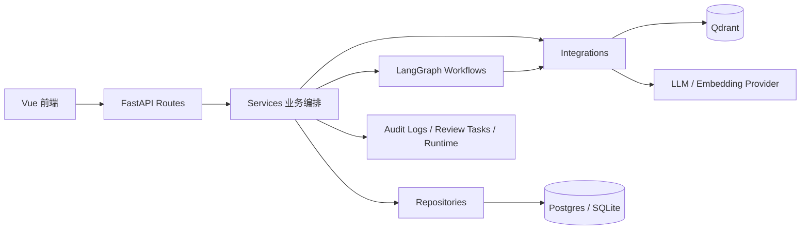
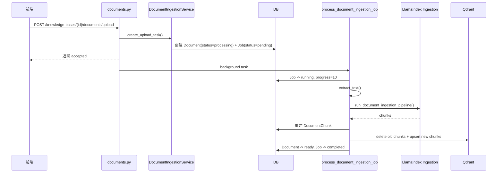
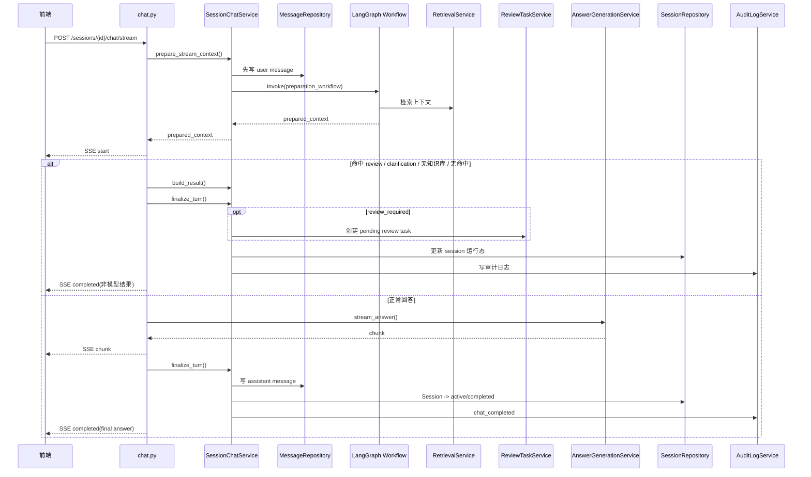
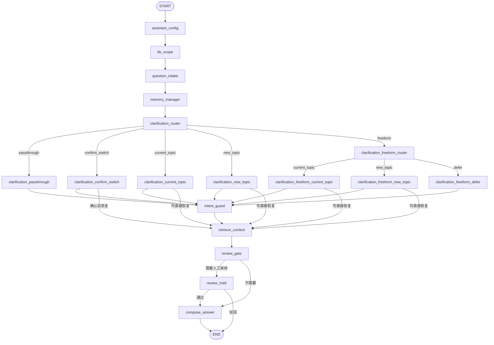
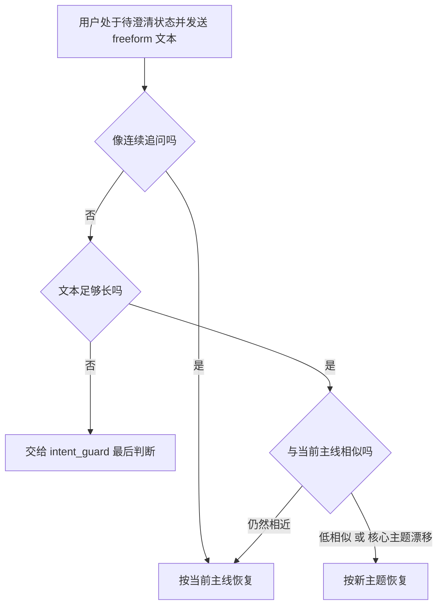
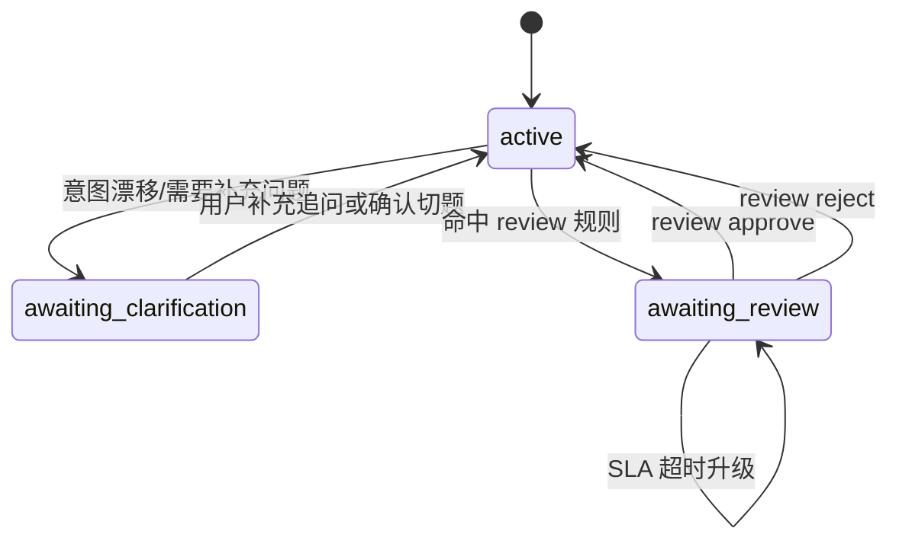
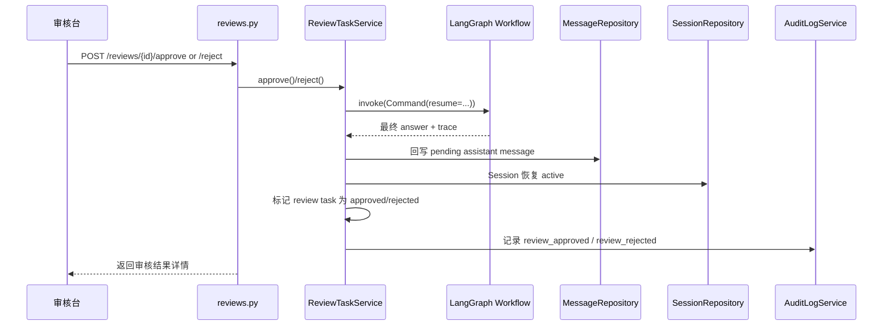
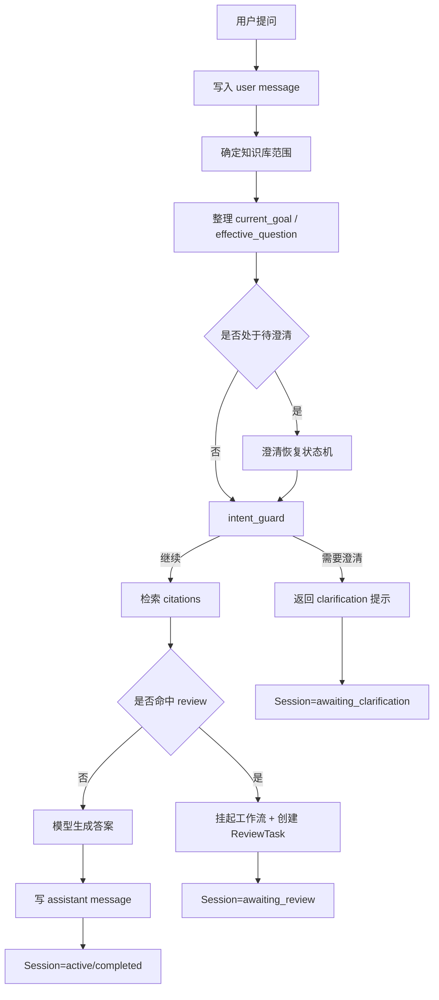

# 企业级 RAG 完整学习手册

> 适用范围：当前仓库实现版  
> 更新时间：2026-04-22  
> 目标：让新人在 1 到 2 小时内看懂后端目录、核心链路、状态机和业务规则

> 边界说明：本文解释的是“当前仓库实现基线”，不是“一期已完成态”。如果你要看一期目标、二期方向和非本期目标，请先读 [一期范围说明](./一期范围说明.md) 和 [企业内部知识库上传式RAG开发计划_AI执行版](./企业内部知识库上传式RAG开发计划_AI执行版.md)。

## 1. 先看结论

当前后端已经收口成一套比较稳定的结构，理解它时不要从“所有文件”开始，而要先抓住两条主链路：

1. 文档入库链路
2. 会话问答链路

这两条链路之外的系统总览、审核台、任务中心，本质上都是围绕这两条主链路做治理和可观测性。

当前后端最重要的设计原则只有三条：

1. `api/routes` 只做接请求、校验、调服务，不承载复杂业务。
2. `services` 负责业务编排，`workflows` 负责 LangGraph 状态机规则。
3. 会话复杂度主要集中在“澄清、意图漂移、人工审核”三件事上。

---

## 2. 建议学习路径

如果你第一次读这个项目，推荐按下面顺序看：

1. 先看本文，建立全局认知。
2. 再看 `server/app/api/routes/chat.py`，知道对话入口长什么样。
3. 再看 `server/app/services/chat_rag.py`，理解“如何启动一轮会话”。
4. 再看 `server/app/workflows/chat_graph.py`，建立 LangGraph 主图心智模型。
5. 接着看 `server/app/workflows/chat_graph_clarification.py`。
6. 再看 `server/app/workflows/chat_graph_execution.py`。
7. 最后看 `server/app/services/session_runtime_view.py` 和 `server/app/services/system_overview.py`，补齐运行态与治理视角。

不建议上来就钻 `integrations/`。那一层重要，但不是第一阅读优先级。

---

## 3. 后端总体结构



### 3.1 目录职责

```text
server/app/
├── api/
│   ├── deps/           # 鉴权与权限依赖
│   └── routes/         # HTTP 入口
├── core/               # 配置、鉴权、SLA、审核规则等核心规则
├── db/                 # SQLAlchemy session / base
├── integrations/       # Qdrant、LlamaIndex、LangGraph checkpointer、模型调用
├── models/             # ORM 模型
├── repositories/       # 数据库读写封装
├── schemas/            # API 出入参与响应结构
├── services/           # 业务编排与后台任务
└── workflows/          # LangGraph 状态机与聊天规则
```

### 3.2 这套分层怎么理解

| 层 | 作用 | 当前是否清晰 |
| --- | --- | --- |
| `api/routes` | HTTP 请求入口、基础校验、权限控制 | 清晰 |
| `services` | 会话、审核、系统总览、文档入库等业务编排 | 清晰 |
| `workflows` | 多轮对话状态机、澄清路由、review 中断恢复 | 是复杂度中心 |
| `repositories` | ORM 读写封装 | 清晰 |
| `integrations` | 向量库、检索器、模型、checkpointer | 清晰 |
| `models/schemas` | 持久化模型与 API 契约 | 清晰 |

可以把它简单理解成：

- `routes` 负责“接”
- `services` 负责“排”
- `workflows` 负责“判”
- `repositories/integrations` 负责“做”

---

## 4. 核心业务对象

| 对象 | 作用 |
| --- | --- |
| `Assistant` | 助理配置中心，包含默认知识库、system prompt、默认模型、review 规则 |
| `KnowledgeBase` | 知识库 |
| `Document` | 上传的原始文档 |
| `DocumentChunk` | 文档切分后的结构化片段 |
| `Session` | 一段多轮会话 |
| `Message` | 会话中的消息，包含 user / assistant |
| `ReviewTask` | 命中审核规则后的人工审核任务 |
| `Job` | 文档入库任务 |
| `WorkflowCheckpoint` | LangGraph checkpoint 落盘记录 |
| `AuditLog` | 审计日志 |
| `AuthUser` | 登录用户 |

这些对象里，最关键的三组关系是：

1. `Assistant -> KnowledgeBase`
2. `Session -> Message`
3. `Session -> ReviewTask -> WorkflowCheckpoint`

### 4.1 RAG 专业名称速查

第一次接触这套系统时，建议先把下面这些词和项目实现一一对上：

| 术语 | 简单解释 | 在当前项目里对应什么 |
| --- | --- | --- |
| `RAG` | `Retrieval-Augmented Generation`，先检索资料，再让 LLM 基于资料生成答案，而不是只靠模型记忆作答。 | `retrieve_context -> compose_answer` 这条主链路 |
| `Knowledge Base / KB` | 检索范围。用户这一问到底去哪些资料里找内容，先由知识库范围决定。 | `KnowledgeBase`、`selected_kb_ids`、`assistant.default_kb_ids` |
| `Ingestion` | 文档入库预处理，把原始文件变成“可检索、可引用”的结构化数据。 | `DocumentIngestionService`、`run_document_ingestion_pipeline()` |
| `Chunk` | 文档切块后的最小检索单元。块太大检索粒度粗，太小又容易丢上下文。 | `DocumentChunk` |
| `Chunk Overlap` | 相邻 chunk 之间保留少量重叠文本，避免一句话被硬切开后上下文断裂。 | `SentenceSplitter(chunk_overlap=50)` |
| `Embedding` | 把文本转成向量，使“语义相近”的问题和片段能被匹配出来。 | `EmbeddingService` |
| `Embedding Provider` | 具体负责计算 embedding 的模型或服务。 | `app/integrations/embedding_provider.py` |
| `向量库 / Vector Database` | 专门存储向量并做相似度检索的数据库。 | `Qdrant` |
| `向量召回` | 基于 embedding 相似度先找一批候选片段，即使关键词不完全一样，也可能召回语义接近的内容。 | `QdrantChunkStore.as_retriever()` 返回的检索结果 |
| `Retriever` | 真正执行“拿用户问题去找 chunk”的组件。 | 单知识库时的 `as_retriever()` |
| `Router Retriever` | 多知识库场景下，把多个 retriever 组合起来做一次统一检索。 | `build_router_retriever()`、`retrieve_many()` |
| `Recall / 召回` | 检索第一阶段，目标是“先尽量别漏”，所以通常会先多拿候选。 | `retrieve()` / `retrieve_many()` 的候选获取阶段 |
| `top_k` | 最终希望保留多少条检索结果。 | Chat API 的 `top_k`、知识库默认 `default_retrieval_top_k` |
| `Overfetch` | 为了给后续重排留空间，先取比 `top_k` 更多的候选结果。 | `retrieval_overfetch_factor` |
| `Rerank / 重排` | 对召回结果做二次排序，把最相关的片段放到最前面。 | `LexicalRerankPostprocessor` |
| `词法相关性 / Lexical Score` | 看 query 和 chunk 在词面、关键词层面的重叠程度。它不关心深层语义，更像“关键词命中分”。 | `lexical_score` |
| `Citation` | 回答引用的证据片段。前端可以据此展示“答案依据来自哪段文档”。 | `citations` |
| `Prompt` | 发送给 LLM 的最终输入，通常由系统指令、用户问题、检索片段、记忆摘要一起拼出来。 | `AnswerGenerationService.build_messages()` |
| `LLM` | 负责生成最终自然语言答案的大语言模型。 | `ChatModelService` |
| `Fallback` | 主链路不能继续按“检索后生成”执行时的业务分支。当前 `fallback_reason` 主要承载没选知识库、要澄清、需要人工审核；不是所有兜底回答都会写进这个字段。 | `fallback_reason` |
| `Hallucination / 幻觉` | 模型编造出引用里没有的制度、流程或数字。RAG 的核心目标之一，就是尽量降低这类无依据回答。 | 当前通过 `citations`、review 和 prompt 约束来降低风险 |

可以把当前项目的 RAG 链路记成一句话：

> 原始文档 -> `Chunk` -> `Embedding` -> `Qdrant` -> `Retriever` -> `Rerank` -> `Citations` -> `LLM Answer`

---

## 5. 两条主链路

### 5.1 文档入库链路



### 5.2 会话问答链路



---

## 6. API 入口地图

| 路由分组 | 主要职责 |
| --- | --- |
| `auth.py` | 登录、当前用户 |
| `assistants.py` | 助理管理 |
| `knowledge_bases.py` | 知识库管理 |
| `documents.py` | 文档上传、删除、列表 |
| `jobs.py` | 文档入库任务、重试 |
| `sessions.py` | 会话列表、详情、删除、审计日志 |
| `chat.py` | 消息列表、流式问答 |
| `reviews.py` | 审核任务列表、详情、通过、驳回 |
| `system.py` | 系统总览、维护动作 |
| `health.py` | 健康检查 |

### 6.1 权限模型

路由层统一通过 `require_permissions(...)` 做权限控制。典型权限有：

- `session:read`
- `session:write`
- `chat:write`
- `review:read`
- `review:write`
- `document:read`
- `document:write`
- `job:read`
- `job:write`
- `system:read`
- `system:write`

如果 `AUTH_ENABLED=false`，系统会直接返回一个 system principal，适合本地开发和测试，不适合正式环境。

---

## 7. 聊天工作流总览

当前工作流构建入口只有一个：`server/app/workflows/chat_graph.py` 中的 `build_chat_workflow()`。

它有两个运行模式：

1. `include_compose_answer=True`  
   仅用于审核恢复等内部链路，工作流内部会继续走到 `compose_answer`。
2. `include_compose_answer=False`  
   用于前台流式问答预处理，只跑到检索 / review / clarification，真正的 token 输出在路由层完成。

### 7.1 主图



### 7.2 节点职责

| 节点 | 作用 |
| --- | --- |
| `assistant_config` | 加载助理运行配置 |
| `kb_scope` | 决定本轮实际使用的知识库范围 |
| `question_intake` | 识别控制语义，例如“切换到新问题”、“不切换” |
| `memory_manager` | 从最近消息中推导 `current_goal`、`memory_summary`、`effective_question` |
| `clarification_router` | 如果会话已经处于待澄清状态，决定进入哪条澄清恢复分支 |
| `intent_guard` | 核心意图漂移检测器 |
| `retrieve_context` | 检索文档片段 |
| `review_gate` | 命中 review 规则时挂起自动回答 |
| `review_hold` | LangGraph interrupt，等待审核台恢复 |
| `compose_answer` | 生成最终答案或兜底回答 |

---

## 8. 业务规则总表

这一章最重要。项目难点几乎都在这里。

### 8.1 知识库范围选择规则

知识库范围在 `kb_scope` 节点确定，规则固定如下：

1. 先收集用户显式传入的 `knowledge_base_id` 与 `knowledge_base_ids`。
2. 两者合并、去重、去空白。
3. 如果本轮显式指定了知识库，就以用户选择为准。
4. 如果用户没指定，就退回助理默认知识库 `assistant.default_kb_ids`。
5. 最多只取 `max_chat_selected_kb_count` 个，当前默认是 `3`。
6. 如果最终一个知识库都没有，直接进入 `fallback_reason=no_knowledge_base_selected`。

可直接记住一句话：

> 用户显式选择优先，助理默认配置兜底，没有知识库就不做检索。

### 8.2 对话记忆规则

对话记忆由 `memory_manager` 管理，核心有三个字段：

| 字段 | 含义 |
| --- | --- |
| `current_goal` | 当前会话主线问题 |
| `memory_summary` | 最近对话摘要 |
| `effective_question` | 真正用于检索的问题 |

规则如下：

1. 历史窗口取最近 `chat_memory_message_window` 条消息，当前默认是 `6`。
2. `memory_summary` 只保留最近 4 条消息，并把每条内容截断到 80 个字符以内。
3. 如果会话处于 `awaiting_clarification`，优先使用会话 runtime 中记录的 `current_goal`。
4. 否则，`current_goal` 默认取上一条有效 user message。
5. 如果当前问题看起来像追问，`effective_question` 会被改写成：

```text
上一轮问题：{current_goal}
当前追问：{question}
```

这里最容易误解的一点是：

> `awaiting_clarification` 时，`current_goal` 表示“上一轮已经确认过的会话主线”，不是“当前这条最新消息的字面内容”。

例如先聊“年假怎么申请”，后面突然冒出一句“报销流程是什么”，系统如果认为这句话可能切题，会先进入待澄清。这个时点：

- `current_goal` 仍然是“年假怎么申请”
- 新冒出来的话题会先当成“待确认的新问题”保存

这样设计的原因是：用户下一句经常只会回复“不是”“不切换”“继续这个话题”“那最晚什么时候提”，这些短句本身不足以重新定义会话主线。

### 8.3 控制语义识别规则

`question_intake` 不是理解业务内容，而是先识别“用户是不是在发控制指令”。

当前重点识别四类：

| 类型 | 典型前缀或表达 | 结果 |
| --- | --- | --- |
| 继续当前话题 | `继续当前话题`、`不换话题`、`继续这个话题` | `question_control_action=continue_current_topic` |
| 拒绝切题 | `不是`、`不切换`、`先不切换` | `question_control_action=reject_switch` |
| 确认切题 | `是`、`对`、`确认切换`、`切换吧` | `question_control_action=confirm_switch` |
| 显式切题 | `切换到新问题`、`换个问题`、`另外问` | `question_control_action=explicit_switch` |

这一步的价值是：

1. 把“业务问题”和“控制命令”分开。
2. 避免把“切换到新问题：团建预算怎么申请？”当成普通业务文本直接检索。

### 8.4 澄清状态机规则

会话进入待澄清状态后，后续每轮消息都不会直接按普通问题处理，而是优先进入澄清状态机。

当前有三个主要澄清阶段：

| `clarification_stage` | 含义 | 期待输入 |
| --- | --- | --- |
| `confirm_switch` | 等用户确认是否切换主题 | `topic_switch_confirmation` |
| `collect_current_topic_question` | 用户说不切换，但还没给出具体追问 | `follow_up_question` |
| `collect_new_topic_question` | 用户说要换主题，但还没给出新问题 | `new_topic_question` |

### 8.5 澄清路由规则

`clarification_router` 的决策逻辑很直接：

1. 会话不在 `awaiting_clarification`，直接跳过。
2. 如果控制动作是 `continue_current_topic` 或 `reject_switch`，走原主线恢复分支。
3. 如果控制动作是 `explicit_switch`，或者当前阶段本来就在 `collect_new_topic_question`，走新主题恢复分支。
4. 如果控制动作是 `confirm_switch`，或者当前阶段是 `confirm_switch`，走切题确认分支。
5. 其他都进入 freeform 澄清分类分支。

### 8.6 freeform 澄清规则

用户经常不会严格按按钮式回复，而会直接说一段自由文本。所以还有一层 freeform 分类器：



### 8.6.1 澄清阶段的话题切换判定

很多人会误以为：

> 只要用户没有明确说“切换话题”，系统就会一直停留在原话题。

这句话不准确。更准确的规则是：

1. 刚进入 `awaiting_clarification` 时，`current_goal` 会先保留为原主线，也就是话题 1。
2. 如果当前疑似切题的问题需要确认，它会先被当成待确认问题，而不是立刻覆盖主线。
3. 如果用户明确说“是”“确认切换”，系统才会正式把主线切到这个待确认问题。
4. 如果用户明确说“不切换”，或者后续 freeform 回复仍然像原主线的连续追问，系统继续按话题 1 处理。
5. 但如果用户虽然没说“切换话题”，却又补充了一句和原主线低相似、且已经足够明确的新问题，系统也会直接按新主题恢复。

可以用这个例子记：

1. 先聊话题 1：`年假怎么申请`
2. 用户突然问话题 2：`报销流程是什么`
3. 系统认为可能切题，于是先进入澄清
4. 这时主线仍然是话题 1，不会立刻改成话题 2
5. 如果用户回 `是，切换吧`，主线切到“报销流程是什么”
6. 如果用户回 `不是，我是想问年假最晚什么时候提`，继续按话题 1
7. 如果用户没说“切换”，但下一句直接变成 `报销发票丢了怎么办`，且系统判断它已形成明确新问题，也可能直接切到话题 2

所以一句话总结：

> 默认先保留原主线，但 freeform 内容足够明确时，系统可以不依赖显式确认而自动切到新主题。

### 8.6.2 澄清阶段的误判边界

当前实现有一个很现实的前提：

> 系统默认把用户发进会话框的每条消息都当成“在回复助理”，它并不知道你是不是在回别人、是不是在自言自语。

所以在 `awaiting_clarification` 阶段，如果用户没有正面回答系统的澄清问题，而是随手发一句别的话，可能出现两类误判：

1. 短确认词被误判成“确认切题”
2. 模糊短句被误判成“继续当前主线”

第一类最危险。像下面这些词，在当前实现里会直接被当成 `confirm_switch`：

- `是`
- `对`
- `嗯`
- `好的`
- `好`
- `行`
- `确认`

也就是说，如果系统正在等你确认“要不要切换主题”，你这时只是顺手回了一句 `好的`，哪怕你本意是在回别人，系统也可能直接理解成“确认切到新话题”。

第二类也常见。像下面这些回复：

- `收到`
- `等下`
- `我看看`
- `稍等`

它们通常不会命中“确认切题”或“拒绝切题”的显式规则，但又太短、太模糊，系统未必会继续明确追问，而可能把它们当成短追问继续沿原主线往下处理。

例如：

1. 原主线是：`年假怎么申请`
2. 系统因为疑似切题，正在等待你确认是否换主题
3. 你回了一句：`收到`
4. 系统可能不会再次停在澄清，而是把它当成一条很短的 follow-up，继续按原主线进入后续检索或兜底流程

所以这一段要记住的不是“系统一定会错”，而是：

> 当前澄清状态机对“非面向助理的闲聊短句”并不鲁棒，尤其是 `好的`、`行`、`嗯` 这类词，误判风险最高。

如果后面要继续增强这一块，常见改法通常有三个方向：

1. 对 `confirm_switch` 增加更严格的上下文约束，而不是只靠短确认词命中
2. 对 `收到`、`稍等`、`我看看` 这类低信息量回复单独做“保持待澄清，不推进状态机”
3. 前端在待澄清阶段提供明确按钮，降低自由输入带来的歧义

### 8.7 意图漂移检测规则

真正决定“要不要请求澄清”的，是 `intent_guard`。

它的规则不是模型判断，而是当前实现中的轻量文本规则：

1. 先把问题做归一化，只保留中文、字母、数字。
2. 用 bigram 集合做文本相似度计算。
3. 最低相似度阈值是 `0.18`。
4. 如果主线或当前问题太短，小于 `6` 个有效字符，不触发漂移澄清。
5. 如果当前问题像“那这个怎么办”“那最晚什么时候提”这类明显依赖上下文的追问，直接继续，不触发漂移。

除了整体相似度，还做了一层“模板重叠但主题漂移”判断：

1. 先从文本里剥掉“需要什么材料、怎么申请、什么时候提交”这类通用问句模板。
2. 比较剩下的主题核心文本。
3. 如果整体相似度不低，但核心主题相似度低于 `0.18`，认定为“模板相像，但主题已变”。

可以把它理解成：

> “员工请假需要什么材料”和“员工报销需要什么材料”句式很像，但主题核心已经变了，系统会要求确认是否切换主题。

### 8.8 什么时候进入澄清

只要满足下面任一条件，就会进入 `fallback_reason=intent_clarification_required`：

1. 当前问题与 `current_goal` 整体相似度低于阈值。
2. 整体相似度不低，但剥离通用模板后主题核心明显漂移。
3. 用户明确说要换主题，但没给出新问题。
4. 用户明确说不换主题，但没有给出可执行的具体追问。

### 8.9 检索规则

`retrieve_context` 的规则固定如下：

1. 单知识库时调用 `RetrievalService.retrieve()`。
2. 多知识库时调用 `retrieve_many()`。
3. 多知识库检索会先为每个知识库创建 retriever，再交给 router retriever 汇总。
4. 候选召回数量是 `top_k * retrieval_overfetch_factor`，默认因子为 `3`。
5. 多知识库场景下，每个知识库的候选上限默认是 `retrieval_per_kb_top_k=4`。
6. 最终统一经过 `LexicalRerankPostprocessor` 做重排。

当前检索策略可概括为：

> 先多取，再统一重排，尽量兼顾向量召回和词法相关性。

### 8.10 Review 规则

人工审核有两层规则。

第一层是开关：

1. 助理必须 `review_enabled=true`
2. 当前必须有检索命中 `citations`

第二层是命中规则：

`evaluate_review_hit(question, review_rules)` 会按 `priority` 从小到大遍历启用中的规则，命中第一条就触发 review。

支持三种匹配模式：

| 模式 | 含义 |
| --- | --- |
| `contains_any` | 命中任意关键词 |
| `contains_all` | 命中全部关键词 |
| `regex` | 正则匹配 |

默认规则示例：

| 分类 | 严重级别 | 典型关键词 / 模式 |
| --- | --- | --- |
| 法律 | `critical` | `起诉`、`仲裁`、`赔偿`、`违法` |
| 隐私 | `critical` | `身份证号`、`银行卡号`、`手机号` |
| 医疗 | `critical` | `诊断`、`处方`、`用药`、`怀孕` |
| 投资 | `high` | `投资`、`理财`、`股票`、`基金` |

### 8.11 Review 命中后的行为

命中 review 后，不是立刻结束，而是走一套“挂起并可恢复”的流程：

1. `review_gate` 设置 `fallback_reason=review_required`
2. 如果 `review_interrupt_enabled=True`，进入 `review_hold`
3. `review_hold` 通过 LangGraph `interrupt(...)` 挂起当前工作流
4. `SessionChatService.finalize_review_hold()` 先把“待审核回复”写成一条 assistant message
5. 创建 `ReviewTask`
6. 会话状态改成 `awaiting_review`
7. 审核台后续调用 `/reviews/{review_id}/approve` 或 `/reject`
8. `ReviewTaskService` 再通过 `Command(resume=...)` 恢复 LangGraph 线程

### 8.12 审核恢复规则

审核恢复只有两种动作：

| 动作 | 结果 |
| --- | --- |
| `approve` | 回到 `compose_answer`，继续自动生成答案 |
| `reject` | 直接生成人工驳回结论，不再继续自动回答 |

如果驳回时传了 `manual_answer`，最终回复优先使用人工答案。

### 8.13 兜底回答规则

当前系统存在多种兜底场景，但不是每一种都会占用 `fallback_reason`：

| 场景 | `fallback_reason` | 行为 |
| --- | --- | --- |
| 没有知识库范围 | `no_knowledge_base_selected` | 直接返回知识库缺失提示 |
| 意图需要澄清 | `intent_clarification_required` | 返回澄清提示 |
| 没有检索命中 | 无固定 `fallback_reason` | 返回“未检索到相关内容” |
| 命中人工审核 | `review_required` | 返回“需人工复核”提示 |
| 审核驳回 | 无固定 `fallback_reason` | 返回人工结论 |
| 模型不可用 / 失败 | 无固定 `fallback_reason` | 不再伪造降级答案；前台流式接口返回 `error` 事件 |

---

## 9. 会话状态机

会话状态不是一个简单的 `active / inactive`，而是“业务状态 + 等待条件 + 恢复方式”的组合。

### 9.1 生命周期图



### 9.2 运行态映射规则

| 条件 | `status` | `runtime_state` | `waiting_for` | `resume_strategy` |
| --- | --- | --- | --- | --- |
| `fallback_reason=review_required` | `awaiting_review` | `waiting_review` | `human_review` | `command_resume` |
| `review_required + review_status=escalated` | `awaiting_review` | `waiting_review_escalated` | `escalated_human_review` | `command_resume` |
| `intent_clarification_required + confirm_switch` | `awaiting_clarification` | `waiting_clarification_switch` | `topic_switch_confirmation` | `new_user_message` |
| `intent_clarification_required + collect_current_topic_question` | `awaiting_clarification` | `waiting_clarification_question` | `follow_up_question` | `new_user_message` |
| `intent_clarification_required + collect_new_topic_question` | `awaiting_clarification` | `waiting_new_topic_question` | `new_topic_question` | `new_user_message` |
| `review_decision=approved` | `active` | `completed_after_review` | 空 | `none` |
| `review_decision=rejected` | `active` | `completed_with_manual_review` | 空 | `none` |
| 普通完成 | `active` | `completed` | 空 | `none` |

### 9.3 为什么要把运行态单独做成 `workflow_runtime`

原因有三个：

1. 前端会话页需要知道当前卡在哪一步。
2. review 恢复需要知道 `workflow_thread_id` 和 checkpoint 情况。
3. 运维排障时需要知道最后跑到哪个 workflow 节点。

当前对外暴露的运行态已经是“正式字段”版，不再暴露原始 `runtime_context` 大 JSON。

---

## 10. Review 恢复链路



### 10.1 审核升级规则

审核任务有 SLA：

- 人工审核目标时间：`1800` 秒
- warning 阈值：目标的 `50%`

如果 pending review 超过 SLA 还没处理：

1. `ReviewTaskService.reconcile_overdue_reviews()` 会把它标记成 `escalated`
2. 会话运行态改成 `waiting_review_escalated`
3. 写入 `review_escalated` 审计日志

这就是为什么系统总览页会特别关注 `reviews_escalated`。

---

## 11. 前台聊天为什么只保留流式问答

现在前台公开聊天入口只有一个：`POST /sessions/{session_id}/chat/stream`。

执行顺序是：

1. 路由层先调用 `SessionChatService.prepare_stream_context()`
2. 底层跑 `preparation_workflow(include_compose_answer=False)`，只准备检索、review、clarification 所需上下文
3. 路由层 `_stream_or_fallback_answer()` 决定本轮是走模型流式输出，还是直接返回 review / clarification / 无知识库 / 无命中 这类非模型结果
4. 流完整结束后，再调用 `finalize_turn()` 统一落库 assistant 消息、更新 session 运行态和审计日志

这样设计的好处是：

1. 前台入口单一，接口语义更稳定
2. SSE 的 `start / chunk / completed / error` 事件边界更清楚
3. review / clarification 这类不会真正进入 LLM 的场景，也能复用同一套前置工作流

要特别注意两点：

1. 公共同步接口 `POST /sessions/{session_id}/chat` 已删除
2. `include_compose_answer=True` 还保留着，但它只服务于审核恢复这类内部链路，不再作为前台聊天入口

---

## 12. 文档入库业务规则

文档入库是另一条核心链路，虽然复杂度远低于聊天状态机，但它决定知识库能不能工作。

### 12.1 上传规则

上传文档时会发生这些事：

1. 校验知识库存在。
2. 校验文件名存在。
3. 原始文件落到 `storage/uploads/{knowledge_base_id}/`。
4. 创建 `Document(status=processing)`。
5. 创建 `Job(job_type=document_ingestion, status=pending)`。
6. 异步触发 `process_document_ingestion_job()`。

### 12.2 入库任务执行规则

后台任务的执行阶段如下：

1. `10%`：任务进入 running
2. `35%`：完成文本抽取
3. `60%`：完成切块并写入 `DocumentChunk`
4. `90%`：完成向量写入 Qdrant
5. `100%`：`Document=ready`，`Job=completed`

失败时：

1. `Document.status=failed`
2. `Job.status=failed`
3. `Job.error_message` 记录错误

### 12.3 重试规则

只有满足下面条件，文档入库任务才允许重试：

1. `job_type=document_ingestion`
2. `job.status=failed`
3. 对应文档仍存在
4. 原始文件路径还存在

系统支持：

- 单任务重试
- 批量重试
- 系统维护时批量重试失败任务

### 12.4 入库 SLA

文档入库也有 SLA：

- 目标时间：`300` 秒
- warning 阈值：目标的 `60%`

系统总览页会根据这个 SLA 统计：

- `jobs_warning`
- `jobs_breached`
- `jobs_failed`

---

## 13. 系统总览与治理能力

`SystemOverviewService` 不是业务主链路，但它是理解“系统是否健康”的入口。

### 13.1 `/system/overview` 在看什么

它会输出五类信息：

1. `summary`  
   应用名、版本、阶段、前后端技术栈摘要
2. `runtime`  
   当前环境、鉴权、数据库、Qdrant、checkpointer、LLM、Embedding 配置
3. `resources`  
   助理数、知识库数、会话数
4. `sessions / tasks`  
   会话状态分布、job 状态分布、review 状态分布
5. `alerts / readiness`  
   当前风险告警和上线前 readiness 检查

### 13.2 它为什么重要

它实际上在做三件事：

1. 把业务状态变成可观察指标
2. 把部署基线变成显式检查项
3. 把“该不该上线”从经验判断变成规则判断

### 13.3 readiness 检查关注的关键项

当前主要检查：

1. 鉴权是否开启，密钥是否替换
2. 数据库是否已切到 Postgres
3. 数据库 schema 管理是否走 migration
4. workflow checkpointer 是否切到官方 Postgres saver
5. LLM / Embedding provider 是否锁定
6. 默认模型是否在允许列表内
7. LLM / Embedding 的连接配置是否完整

### 13.4 `/system/maintenance/run` 会做什么

当前支持两种维护动作：

1. `reconcile_overdue_reviews`
2. `retry_failed_jobs`

所以它本质上是一个后台治理入口，而不是业务入口。

---

## 14. 审计日志在记录什么

审计日志不是“可有可无的日志”，而是工作流的重要副产物。

当前核心事件包括：

| 事件 | 说明 |
| --- | --- |
| `chat_completed` | 普通问答完成 |
| `clarification_required` | 会话进入待澄清 |
| `review_pending` | 命中审核规则，创建审核任务 |
| `review_approved` | 审核通过并恢复工作流 |
| `review_rejected` | 审核驳回，写入人工结论 |
| `review_escalated` | 审核超时升级 |
| `review_resume_failed` | 审核恢复失败 |

每条审计日志通常会带上：

1. `question / resolved_question`
2. `current_goal`
3. `review_reason / clarification_reason`
4. `selected_kb_ids`
5. `retrieval_count`
6. `latest_trace`
7. `workflow_trace`

也就是说，审计日志本身就是排障入口。

---

## 15. 最值得读的源码清单

### 15.1 第一批，必须读

| 文件 | 为什么 |
| --- | --- |
| `server/app/api/routes/chat.py` | 看到流式聊天入口、SSE 事件和路由层收尾 |
| `server/app/services/chat_rag.py` | 看到一轮会话如何启动、收尾、落库 |
| `server/app/workflows/chat_graph.py` | 看到主图结构 |
| `server/app/workflows/chat_graph_clarification.py` | 看到澄清和意图漂移规则 |
| `server/app/workflows/chat_graph_execution.py` | 看到检索、review、回答生成 |

### 15.2 第二批，理解治理和运行态

| 文件 | 为什么 |
| --- | --- |
| `server/app/services/session_runtime_view.py` | 会话页为什么能看到运行态 |
| `server/app/services/workflow_runtime.py` | 会话生命周期映射规则 |
| `server/app/services/review_tasks.py` | 审核恢复是怎么做到的 |
| `server/app/services/system_overview.py` | 系统治理口径如何统一 |
| `server/app/services/audit_logs.py` | 审计如何绑定工作流 |

### 15.3 第三批，补齐底层实现

| 文件 | 为什么 |
| --- | --- |
| `server/app/services/retrieval.py` | 检索策略 |
| `server/app/services/answer_generation.py` | Prompt 组织和模型调用失败边界 |
| `server/app/services/document_ingestion.py` | 文档入库主逻辑 |
| `server/app/core/review_rules.py` | review 规则实现 |
| `server/app/core/task_sla.py` | SLA 规则实现 |

---

## 16. 看代码时最容易绕的点

### 16.1 “resolved_question”和“effective_question”不是一回事

- `resolved_question` 是业务上最终认定的问题
- `effective_question` 是为了检索效果做过上下文补全后的问题

### 16.2 “会话状态”和“工作流节点”不是一回事

- 会话状态看的是 `active / awaiting_review / awaiting_clarification`
- 工作流节点看的是 `intent_guard / retrieve_context / review_gate ...`

### 16.3 review 并不是单纯返回一个提示

review 真正重要的是：

1. 工作流被中断
2. thread_id 被保留
3. 审核结论可以恢复原工作流继续跑

### 16.4 前台流式问答不是“workflow 直接开 stream=True”

它是两段式：

1. 先跑 `preparation_workflow(include_compose_answer=False)`
2. 再在路由层 `_stream_or_fallback_answer()` 决定输出模型 chunk、非模型结果，或者 `error` 事件
3. 最后用 `finalize_turn()` 统一做落库和运行态收尾

---

## 17. 新人排障清单

当你遇到“这个问题为什么没回答 / 为什么进入 review / 为什么会卡住”时，按这个顺序查。

1. 查 `Session.workflow_runtime.runtime_state`
2. 查 `waiting_for` 和 `resume_strategy`
3. 查 `latest_node` 与 `latest_node_detail`
4. 查会话审计日志
5. 如果在 review，查 `ReviewTask.status`、`review_reason`、`workflow_thread_id`
6. 如果在检索，查 `selected_kb_ids`、`retrieval_count`
7. 如果是模型问题，查同步接口返回的 5xx 明细或流式接口的 `error` 事件内容

---

## 18. 当前代码结构的真实评价

如果从学习成本看，当前后端已经到了“可以稳定扩展”的阶段。

### 18.1 已经清晰的部分

1. 路由层基本都是薄层
2. 系统总览、会话运行态、审核恢复都已经独立成服务
3. workflow 主入口已经足够薄
4. 原先很多对前端暴露的重复运行态字段已经删掉

### 18.2 仍然偏重的部分

只剩两个真正的复杂热点：

1. `chat_graph_clarification.py`
2. `chat_graph_support.py`

这不是目录分层问题，而是“多轮澄清业务本身复杂”。

### 18.3 对新人最实用的判断

你不需要一次读懂全仓库，只要先读懂下面四件事，就能进入开发状态：

1. 会话是怎么从 route 进入 `SessionChatService` 的
2. `build_chat_workflow()` 主图长什么样
3. 什么情况下会进入 clarification
4. 什么情况下会进入 review

掌握这四件事，后面再补检索、审核台、系统总览，就很顺了。

---

## 19. 一页速记版

如果你只想记住最关键的内容，记下面这张图就够了。



一句话总结：

> 当前系统本质上是“检索增强问答 + 意图漂移澄清 + 可恢复人工审核”的企业会话引擎。
