# 澄清与意图漂移流程实例演示

本文不再抽象解释节点，而是直接用“具体会话数据 + 多轮对话 + 节点 trace + 图”的方式，把这条问答 workflow 跑一遍。

重点覆盖：

- 普通问答
- 追问改写
- 意图漂移触发澄清
- 用户确认切题
- 用户拒绝切题并继续原话题
- 用户切到新主题但没给具体问题
- 用户后续补充新主题问题
- freeform 澄清恢复到原主线
- freeform 澄清恢复到新主题
- freeform 文本太弱，回退给 `intent_guard`
- 命中 review 后中断、审批通过、审批驳回
- 无知识库
- 检索无命中

相关代码：

- workflow 装配：[server/app/workflows/chat_graph.py](server/app/workflows/chat_graph.py)
- 澄清与意图守卫：[server/app/workflows/chat_graph_clarification.py](server/app/workflows/chat_graph_clarification.py)
- 检索与 review：[server/app/workflows/chat_graph_execution.py](server/app/workflows/chat_graph_execution.py)
- state 与辅助函数：[server/app/workflows/chat_graph_support.py](server/app/workflows/chat_graph_support.py)
- 外层调用：[server/app/services/chat_rag.py](server/app/services/chat_rag.py)

## 1. 先给一张总图

下面这张图是代码真实执行顺序，不是概念图。

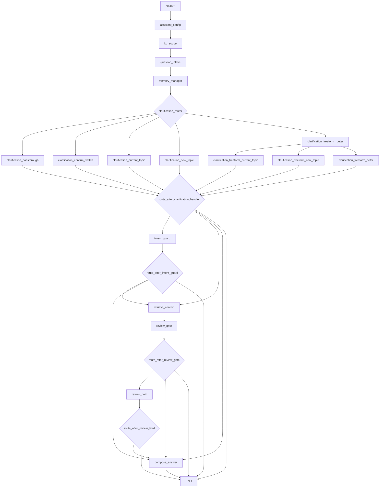

当前 SSE 流式接口里，实际使用的是：

```text
include_compose_answer = False
```

所以在 SSE 场景下：

- 图里虽然有 `compose_answer` 这条概念路径
- 但当前 `event_stream` 用的那条 graph 不会注册 `compose_answer`
- 最终回答在 graph 外部 `_stream_or_fallback_answer()` 里生成

## 2. 我们统一用的示例环境

为了让多轮会话连得起来，下面所有案例默认沿用同一套基础配置。

### 2.1 助理配置

```json
{
  "assistant_id": "asst_hr_01",
  "assistant_name": "HR政策助手",
  "system_prompt": "请严格依据公司制度回答。",
  "default_model": "gpt-4o-mini",
  "default_kb_ids": ["kb_hr_policy", "kb_finance_policy"],
  "review_enabled": false,
  "review_rules": []
}
```

### 2.2 常用知识库

```json
[
  {
    "knowledge_base_id": "kb_hr_policy",
    "name": "人事制度库"
  },
  {
    "knowledge_base_id": "kb_finance_policy",
    "name": "财务制度库"
  }
]
```

### 2.3 常见检索命中样例

为方便理解，下面案例中的检索结果会写成这种简化结构：

```json
[
  {
    "knowledge_base_id": "kb_finance_policy",
    "file_name": "员工报销制度.pdf",
    "content": "差旅报销需提交发票、行程单、审批单。",
    "score": 0.81
  }
]
```

### 2.4 当前工作流初始输入的大致样子

真实调用入口是：

- [server/app/services/chat_rag.py](server/app/services/chat_rag.py)

它传给 graph 的 state 大致是：

```json
{
  "assistant_id": "asst_hr_01",
  "assistant_name": "HR政策助手",
  "assistant_config": {
    "assistant_id": "asst_hr_01",
    "assistant_name": "HR政策助手",
    "system_prompt": "请严格依据公司制度回答。",
    "default_model": "gpt-4o-mini",
    "default_kb_ids": ["kb_hr_policy", "kb_finance_policy"],
    "review_enabled": false,
    "review_rules": []
  },
  "session_status": "active",
  "session_runtime_context": {},
  "session_runtime_state": "completed",
  "question": "用户当前这轮输入",
  "requested_knowledge_base_ids": [],
  "message_history": [],
  "top_k": 4,
  "review_interrupt_enabled": true
}
```

## 3. 分支覆盖地图

下面这些场景会把主要分支尽量走到：

| 场景 | 目标 |
| --- | --- |
| 场景 A | 普通问题，直接检索 |
| 场景 B | 连续追问，`effective_question` 改写 |
| 场景 C | 意图漂移，触发 `confirm_switch` 澄清 |
| 场景 D | 用户确认切题，走 `clarification_confirm_switch` |
| 场景 E | 用户拒绝切题并继续原话题，走 `clarification_current_topic` |
| 场景 F | 用户说要切题但没给具体问题，走 `new_topic_question` |
| 场景 G | 用户补充新主题问题，走 `clarification_new_topic` |
| 场景 H | freeform 回复恢复到原主线 |
| 场景 I | freeform 回复恢复到新主题 |
| 场景 J | freeform 回复太弱，走 `clarification_freeform_defer -> intent_guard` |
| 场景 K | 命中 review，中断并审批通过 |
| 场景 L | 命中 review，中断并驳回 |
| 场景 M | 没有知识库 |
| 场景 N | 检索无命中 |

## 4. 用一条主会话贯穿澄清与意图漂移

下面先聚焦最绕的部分：

- `question_intake`
- `memory_manager`
- `clarification_router`
- `clarification_*`
- `intent_guard`

我们用同一个 session，连续跑多轮。

---

## 5. 场景 A：普通单轮问答

### 5.1 会话初始状态

```json
{
  "session_status": "active",
  "session_runtime_state": "completed",
  "session_runtime_context": {},
  "message_history": []
}
```

### 5.2 当前用户输入

```text
报销需要什么材料？
```

### 5.3 节点逐步执行

| 节点 | 关键输入 | 关键输出 | 说明 |
| --- | --- | --- | --- |
| `assistant_config` | assistant_config | `assistant_id`、`assistant_name` | 载入助理配置 |
| `kb_scope` | default_kb_ids | `selected_kb_ids=["kb_hr_policy","kb_finance_policy"]` | 使用默认知识库 |
| `question_intake` | `question=报销需要什么材料？` | `raw_question=报销需要什么材料？`、`normalized_question=报销需要什么材料？`、`question_control_action=""` | 没有控制语义 |
| `memory_manager` | 无历史 | `current_goal=报销需要什么材料？`、`resolved_question=报销需要什么材料？`、`effective_question=报销需要什么材料？` | 第一轮，没有多轮上下文 |
| `clarification_router` | `session_status=active` | `clarification_route=clarification_passthrough` | 不走澄清状态机 |
| `clarification_passthrough` | - | `clarification_action=skip` | 直接跳过 |
| `route_after_clarification_handler` | `clarification_action=skip` | `intent_guard` | 默认进入意图守卫 |
| `intent_guard` | 无历史 | `intent_action=continue` | 历史不足，不做漂移检测 |
| `route_after_intent_guard` | 有知识库 | `retrieve_context` | 进入检索 |
| `retrieve_context` | `effective_question=报销需要什么材料？` | citations 命中 | 检索财务制度 |
| `review_gate` | `review_enabled=false` | 无修改 | 不审核运行 |

### 5.4 路由图


### 5.5 最终工作流结果

```json
{
  "resolved_question": "报销需要什么材料？",
  "effective_question": "报销需要什么材料？",
  "current_goal": "报销需要什么材料？",
  "selected_kb_ids": ["kb_hr_policy", "kb_finance_policy"],
  "retrieval_count": 2,
  "fallback_reason": null
}
```

### 5.6 SSE 外层会怎么做

因为当前流式接口用的是 `include_compose_answer=False`，所以 graph 到这里结束，外层路由再继续：

```text
_stream_or_fallback_answer()
-> 发现有 citations 且没有 fallback
-> 调用 AnswerGenerationService.stream_answer()
-> SSE 连续输出 chunk
```

---

## 6. 场景 B：连续追问，`effective_question` 被改写

### 6.1 历史消息

```json
[
  {
    "role": "user",
    "content": "报销需要什么材料？"
  },
  {
    "role": "assistant",
    "content": "差旅报销通常需要发票、审批单和行程单。"
  }
]
```

### 6.2 当前用户输入

```text
那审批要多久？
```

### 6.3 节点关键变化

#### `question_intake`

```json
{
  "raw_question": "那审批要多久？",
  "normalized_question": "那审批要多久？",
  "question_control_action": ""
}
```

这里没有控制语义，“那”只是追问口吻，不属于澄清控制动作。

#### `memory_manager`

`_resolve_current_goal()`：

- `session_status` 不是 `awaiting_clarification`
- 取历史里最后一条 `user` 消息
- 所以：

```json
{
  "current_goal": "报销需要什么材料？"
}
```

然后 `_resolve_effective_question()` 判断当前问题像追问：

- 长度短
- 以 `那` 开头

所以它把检索问题改写为：

```text
上一轮问题：报销需要什么材料？
当前追问：那审批要多久？
```

最终：

```json
{
  "resolved_question": "那审批要多久？",
  "effective_question": "上一轮问题：报销需要什么材料？\n当前追问：那审批要多久？",
  "current_goal": "报销需要什么材料？"
}
```

#### `intent_guard`

`_looks_like_context_dependent_follow_up(question)` 为真，因为问题以 `那` 开头。

所以直接：

```json
{
  "intent_action": "continue",
  "intent_drift_score": 0.0
}
```

不会把它误判成切题。

### 6.4 路由图

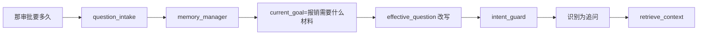

### 6.5 这个场景的核心结论

- `resolved_question` 是给用户看的“本轮真实问题”
- `effective_question` 是给检索系统看的“带上下文的 query”
- `intent_guard` 会对明显追问做保护，不轻易触发“意图漂移”

---

## 7. 场景 C：意图漂移，要求用户确认是否切题

这是最典型的“看起来像是突然换了话题”的情况。

### 7.1 历史消息

```json
[
  {
    "role": "user",
    "content": "报销需要什么材料？"
  },
  {
    "role": "assistant",
    "content": "差旅报销通常需要发票、审批单和行程单。"
  }
]
```

### 7.2 当前用户输入

```text
请假最晚什么时候提？
```

### 7.3 节点逐步执行

#### `question_intake`

没有控制语义：

```json
{
  "raw_question": "请假最晚什么时候提？",
  "normalized_question": "请假最晚什么时候提？",
  "question_control_action": ""
}
```

#### `memory_manager`

因为不是待澄清状态，所以当前主线取历史最后一条用户消息：

```json
{
  "current_goal": "报销需要什么材料？",
  "resolved_question": "请假最晚什么时候提？",
  "effective_question": "请假最晚什么时候提？"
}
```

#### `clarification_router`

当前 `session_status=active`，因此：

```json
{
  "clarification_route": "clarification_passthrough"
}
```

#### `intent_guard`

现在开始做漂移判断。

对比的是：

```text
current_goal = 报销需要什么材料？
question = 请假最晚什么时候提？
```

这不是追问，也不是显式切题，长度也足够，所以会进入 `_analyze_intent_similarity()`。

预期效果：

- `similarity` 很低
- 低于 `_INTENT_GUARD_MIN_SIMILARITY = 0.18`

于是它返回：

```json
{
  "intent_action": "clarify",
  "intent_drift_score": 0.88,
  "clarification_type": "confirm_switch",
  "clarification_stage": "confirm_switch",
  "clarification_expected_input": "topic_switch_confirmation",
  "clarification_reason": "当前问题与原主线相关性较弱，需要确认是否切换主题。",
  "fallback_reason": "intent_clarification_required",
  "citations": [],
  "retrieval_count": 0
}
```

注意：

- 一旦这里触发 `intent_clarification_required`
- 这轮就不会再进入检索

### 7.4 路由图

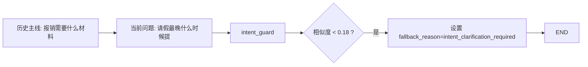

### 7.5 这轮结束后，session 会被持久化成什么样

外层 `finalize_turn()` 会把当前 session 更新为待澄清状态，大致像这样：

```json
{
  "status": "awaiting_clarification",
  "runtime_state": "waiting_clarification_switch",
  "runtime_current_goal": "报销需要什么材料？",
  "runtime_resolved_question": "请假最晚什么时候提？",
  "runtime_pending_question": "请假最晚什么时候提？",
  "runtime_clarification_type": "confirm_switch",
  "runtime_clarification_stage": "confirm_switch",
  "runtime_clarification_expected_input": "topic_switch_confirmation",
  "runtime_clarification_reason": "当前问题与原主线相关性较弱，需要确认是否切换主题。"
}
```

这个状态是后续多轮恢复的关键。

### 7.6 SSE 给前端的不是检索结果，而是澄清提示

graph 到这里结束后，外层路由会看到：

```json
{
  "fallback_reason": "intent_clarification_required"
}
```

于是调用：

- `build_intent_clarification_answer(...)`

得到的提示大意是：

```text
你当前的问题“请假最晚什么时候提？”可能已经偏离本次会话主线“报销需要什么材料？”。
如果你是想继续围绕当前主线追问，请补充更具体的上下文；
如果你确认要切换到新主题，可以直接明确说明“切换到新问题：...”。
```

---

## 8. 场景 D：用户确认切题，走 `clarification_confirm_switch`

这是场景 C 的下一轮。

### 8.1 上一轮遗留的 session 状态

```json
{
  "session_status": "awaiting_clarification",
  "session_runtime_state": "waiting_clarification_switch",
  "session_runtime_context": {
    "current_goal": "报销需要什么材料？",
    "pending_question": "请假最晚什么时候提？",
    "clarification_type": "confirm_switch",
    "clarification_stage": "confirm_switch",
    "clarification_expected_input": "topic_switch_confirmation",
    "clarification_reason": "当前问题与原主线相关性较弱，需要确认是否切换主题。"
  }
}
```

### 8.2 当前用户输入

```text
是的
```

### 8.3 节点逐步执行

#### `question_intake`

因为当前会话处于 `awaiting_clarification`，会识别确认切题：

```json
{
  "raw_question": "是的",
  "normalized_question": "",
  "question_control_action": "confirm_switch"
}
```

#### `memory_manager`

这里要注意一个细节：

- `question` 是空，因为这轮用户只是在“确认”，并没有给新问题文本
- `_resolve_current_goal()` 在 `awaiting_clarification` 下优先使用 `session_runtime_context.current_goal`

因此输出是：

```json
{
  "current_goal": "报销需要什么材料？",
  "resolved_question": "",
  "effective_question": ""
}
```

#### `clarification_router`

因为：

```text
question_control_action == "confirm_switch"
```

所以会进入：

```text
clarification_confirm_switch
```

#### `clarification_confirm_switch`

它会读取：

```json
{
  "pending_question": "请假最晚什么时候提？"
}
```

并恢复这个问题：

```json
{
  "current_goal": "请假最晚什么时候提？",
  "resolved_question": "请假最晚什么时候提？",
  "effective_question": "请假最晚什么时候提？",
  "clarification_action": "resume_pending_topic",
  "intent_action": "switch_topic",
  "intent_drift_score": 0.0
}
```

后续直接进入：

```text
retrieve_context
```

### 8.4 路由图

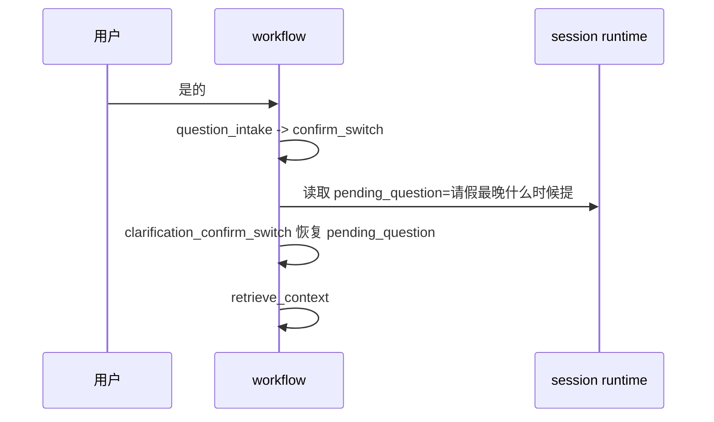

### 8.5 这个场景的关键理解

“是的” 这条输入本身不含业务问题，但 workflow 依然能继续跑下去，是因为：

- 真正的问题已经保存在 `runtime_pending_question`
- 当前这一轮只是一个“控制确认信号”

---

## 9. 场景 E：用户拒绝切题，并继续原话题

这也是场景 C 的下一轮，但用户没有确认切题。

### 9.1 上一轮遗留状态

还是沿用场景 C 结束后的状态：

```json
{
  "session_status": "awaiting_clarification",
  "session_runtime_state": "waiting_clarification_switch",
  "session_runtime_context": {
    "current_goal": "报销需要什么材料？",
    "pending_question": "请假最晚什么时候提？",
    "clarification_stage": "confirm_switch"
  }
}
```

### 9.2 当前用户输入

```text
不是，我是想继续问报销多久到账？
```

### 9.3 节点逐步执行

#### `question_intake`

它会识别到：

- `不是`
- `我是想继续问`

然后提取出真正问题：

```json
{
  "raw_question": "不是，我是想继续问报销多久到账？",
  "normalized_question": "报销多久到账？",
  "question_control_action": "reject_switch"
}
```

#### `memory_manager`

当前 `session_status=awaiting_clarification`，因此 `current_goal` 优先使用 runtime 里的老主线：

```json
{
  "current_goal": "报销需要什么材料？",
  "resolved_question": "报销多久到账？",
  "effective_question": "报销多久到账？"
}
```

#### `clarification_router`

由于：

```text
question_control_action in {"continue_current_topic", "reject_switch"}
```

因此路由到：

```text
clarification_current_topic
```

#### `clarification_current_topic`

当前不是 `continue_current_topic`，而是 `reject_switch`。

代码逻辑会走：

```text
if question:
    _build_current_topic_follow_up_resolution(...)
```

结果：

```json
{
  "current_goal": "报销多久到账？",
  "resolved_question": "报销多久到账？",
  "effective_question": "报销多久到账？",
  "clarification_action": "resume_current_topic",
  "intent_action": "continue",
  "intent_drift_score": 0.0
}
```

注意：

- 这里恢复原主线后，`current_goal` 会更新成更具体的当前追问
- 后续直接进入检索

### 9.4 路由图

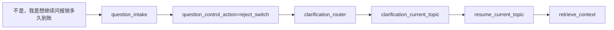

### 9.5 这个场景的关键理解

`reject_switch` 的意思不是“什么都不做”，而是：

- 用户明确拒绝切到 pending_question
- 并把问题重定向回原会话主线

---

## 10. 场景 F：用户说要换话题，但没给具体问题

这个分支会走到 `clarification_type=new_topic_question`。

### 10.1 前置状态

仍然假设上一轮已经进入待澄清：

```json
{
  "session_status": "awaiting_clarification",
  "session_runtime_state": "waiting_clarification_switch",
  "session_runtime_context": {
    "current_goal": "报销需要什么材料？",
    "pending_question": "请假最晚什么时候提？",
    "clarification_stage": "confirm_switch"
  }
}
```

### 10.2 当前用户输入

```text
切换到新问题
```

### 10.3 节点逐步执行

#### `question_intake`

命中显式切题前缀，但没有提取出问题文本：

```json
{
  "raw_question": "切换到新问题",
  "normalized_question": "",
  "question_control_action": "explicit_switch"
}
```

#### `memory_manager`

当前仍处于待澄清，所以：

```json
{
  "current_goal": "报销需要什么材料？",
  "resolved_question": "",
  "effective_question": ""
}
```

#### `clarification_router`

因为：

```text
question_control_action == "explicit_switch"
```

所以进入：

```text
clarification_new_topic
```

#### `clarification_new_topic`

当前：

- 不是 `collect_new_topic_question` 阶段
- `question` 为空

因此调用 `_build_new_topic_question_clarification(...)`，输出：

```json
{
  "current_goal": "报销需要什么材料？",
  "resolved_question": "",
  "effective_question": "",
  "clarification_action": "wait_for_new_topic_question",
  "clarification_type": "new_topic_question",
  "clarification_stage": "collect_new_topic_question",
  "clarification_expected_input": "new_topic_question",
  "clarification_reason": "用户已明确表示要切换主题，但尚未给出新主题的具体问题。",
  "intent_action": "clarify",
  "fallback_reason": "intent_clarification_required",
  "citations": [],
  "retrieval_count": 0
}
```

### 10.4 这一轮结束后，session 会变成什么

外层持久化后：

```json
{
  "status": "awaiting_clarification",
  "runtime_state": "waiting_new_topic_question",
  "runtime_current_goal": "报销需要什么材料？",
  "runtime_pending_question": "",
  "runtime_clarification_type": "new_topic_question",
  "runtime_clarification_stage": "collect_new_topic_question",
  "runtime_clarification_expected_input": "new_topic_question"
}
```

### 10.5 给用户的提示大意

```text
已理解你准备切换到新主题，但这次消息里还没有包含可直接处理的具体问题。
请直接补充新的问题，例如“团建预算怎么申请？”
```

---

## 11. 场景 G：用户补充新主题问题，走 `clarification_new_topic`

这是场景 F 的下一轮。

### 11.1 前置状态

```json
{
  "session_status": "awaiting_clarification",
  "session_runtime_state": "waiting_new_topic_question",
  "session_runtime_context": {
    "current_goal": "报销需要什么材料？",
    "clarification_type": "new_topic_question",
    "clarification_stage": "collect_new_topic_question"
  }
}
```

### 11.2 当前用户输入

```text
团建预算怎么申请？
```

### 11.3 节点逐步执行

#### `question_intake`

这句本身没有显式“切换到新问题”前缀，所以：

```json
{
  "raw_question": "团建预算怎么申请？",
  "normalized_question": "团建预算怎么申请？",
  "question_control_action": ""
}
```

#### `memory_manager`

由于当前仍处于待澄清：

```json
{
  "current_goal": "报销需要什么材料？",
  "resolved_question": "团建预算怎么申请？",
  "effective_question": "团建预算怎么申请？"
}
```

#### `clarification_router`

虽然没有显式控制动作，但：

```text
clarification_stage == collect_new_topic_question
```

所以仍然路由到：

```text
clarification_new_topic
```

#### `clarification_new_topic`

因为当前阶段是 `collect_new_topic_question`，并且 `question` 非空，所以：

```json
{
  "current_goal": "团建预算怎么申请？",
  "resolved_question": "团建预算怎么申请？",
  "effective_question": "团建预算怎么申请？",
  "clarification_action": "switch_to_new_topic",
  "intent_action": "switch_topic",
  "intent_drift_score": 0.0
}
```

后续直接进入检索。

### 11.4 路由图

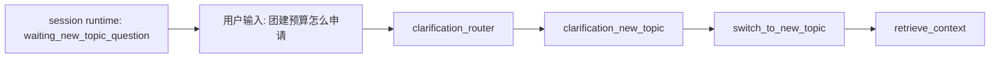

---

## 12. 进入 freeform 澄清分支前，先造一个状态

要想走到 `clarification_freeform_router`，必须让 session 处于：

```text
awaiting_clarification
且 clarification_stage != confirm_switch
且 clarification_stage != collect_new_topic_question
```

最常见的方式是：

- 上一轮用户说“继续当前话题”
- 但没有给出具体问题
- 于是系统进入 `collect_current_topic_question`

我们先造出这个状态。

### 12.1 造状态的上一轮输入

假设当前老主线还是：

```text
报销需要什么材料？
```

上一轮用户只回复：

```text
继续当前话题
```

这会产生：

```json
{
  "status": "awaiting_clarification",
  "runtime_state": "waiting_clarification_question",
  "runtime_current_goal": "报销需要什么材料？",
  "runtime_clarification_type": "continue_current_topic",
  "runtime_clarification_stage": "collect_current_topic_question",
  "runtime_clarification_expected_input": "follow_up_question"
}
```

接下来我们基于这个状态，分别演示 freeform 三条分支。

---

## 13. 场景 H：freeform 回复恢复到原主线

### 13.1 前置状态

```json
{
  "session_status": "awaiting_clarification",
  "session_runtime_state": "waiting_clarification_question",
  "session_runtime_context": {
    "current_goal": "报销需要什么材料？",
    "clarification_type": "continue_current_topic",
    "clarification_stage": "collect_current_topic_question"
  }
}
```

### 13.2 当前用户输入

```text
这个流程需要谁审批？
```

### 13.3 节点逐步执行

#### `question_intake`

没有继续/切换的显式控制前缀，因此：

```json
{
  "raw_question": "这个流程需要谁审批？",
  "normalized_question": "这个流程需要谁审批？",
  "question_control_action": ""
}
```

#### `memory_manager`

仍处于待澄清：

```json
{
  "current_goal": "报销需要什么材料？",
  "resolved_question": "这个流程需要谁审批？",
  "effective_question": "上一轮问题：报销需要什么材料？\n当前追问：这个流程需要谁审批？"
}
```

这里 `effective_question` 已经被改写，因为 `这个流程...` 很像依赖上下文的追问。

#### `clarification_router`

当前阶段是 `collect_current_topic_question`，既不是 `confirm_switch`，也不是 `collect_new_topic_question`，因此进入：

```text
clarification_freeform_router
```

#### `clarification_freeform_router`

`_looks_like_context_dependent_follow_up(question)` 为真，因为问题包含：

```text
这个
```

于是输出：

```json
{
  "clarification_freeform_route": "clarification_freeform_current_topic"
}
```

#### `clarification_freeform_current_topic`

会调用 `_build_current_topic_follow_up_resolution(...)`，最终得到：

```json
{
  "current_goal": "这个流程需要谁审批？",
  "resolved_question": "这个流程需要谁审批？",
  "effective_question": "上一轮问题：报销需要什么材料？\n当前追问：这个流程需要谁审批？",
  "clarification_action": "resume_current_topic",
  "intent_action": "continue",
  "intent_drift_score": 0.0
}
```

### 13.4 路由图

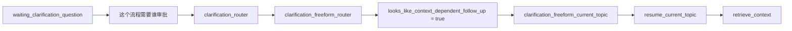

---

## 14. 场景 I：freeform 回复被识别为新主题

同样从 `waiting_clarification_question` 这个状态出发。

### 14.1 当前用户输入

```text
离职证明怎么开？
```

### 14.2 节点关键变化

#### `question_intake`

```json
{
  "question_control_action": "",
  "normalized_question": "离职证明怎么开？"
}
```

#### `memory_manager`

```json
{
  "current_goal": "报销需要什么材料？",
  "resolved_question": "离职证明怎么开？",
  "effective_question": "离职证明怎么开？"
}
```

#### `clarification_router`

仍然进入：

```text
clarification_freeform_router
```

#### `clarification_freeform_router`

这次它不会命中“上下文依赖追问”规则，因此会继续走相似度判断：

对比：

```text
current_goal = 报销需要什么材料？
question = 离职证明怎么开？
```

预期：

- `similarity` 低
- 明显像新主题

因此路由到：

```text
clarification_freeform_new_topic
```

#### `clarification_freeform_new_topic`

输出：

```json
{
  "current_goal": "离职证明怎么开？",
  "resolved_question": "离职证明怎么开？",
  "effective_question": "离职证明怎么开？",
  "clarification_action": "switch_to_new_topic",
  "intent_action": "switch_topic",
  "intent_drift_score": 0.9
}
```

之后直接进入检索。

### 14.3 路由图

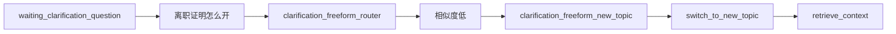

---

## 15. 场景 J：freeform 文本太弱，回退给 `intent_guard`

这个分支很有价值，因为它体现了“代码当前实现”和“理想产品行为”可能不完全一致。

### 15.1 前置状态

仍然是：

```json
{
  "session_status": "awaiting_clarification",
  "session_runtime_state": "waiting_clarification_question",
  "session_runtime_context": {
    "current_goal": "报销需要什么材料？",
    "clarification_stage": "collect_current_topic_question"
  }
}
```

### 15.2 当前用户输入

```text
嗯嗯
```

### 15.3 节点逐步执行

#### `question_intake`

这句不会被识别成：

- `continue_current_topic`
- `confirm_switch`
- `explicit_switch`

所以：

```json
{
  "normalized_question": "嗯嗯",
  "question_control_action": ""
}
```

#### `clarification_router`

因为当前阶段是 `collect_current_topic_question`，所以进入：

```text
clarification_freeform_router
```

#### `clarification_freeform_router`

这句：

- 不像上下文依赖追问
- 归一化后长度不足 `_INTENT_GUARD_MIN_TEXT_LENGTH = 6`

因此输出：

```json
{
  "clarification_freeform_route": "clarification_freeform_defer"
}
```

#### `clarification_freeform_defer`

输出：

```json
{
  "clarification_action": "defer_to_intent_guard"
}
```

#### `route_after_clarification_handler`

这里没有把它送回 `clarification_freeform_router`，也没有直接 fallback，而是默认进入：

```text
intent_guard
```

#### `intent_guard`

此时：

```text
question = 嗯嗯
current_goal = 报销需要什么材料？
```

由于：

```text
len(_normalize_intent_text(question)) < 6
```

所以 `intent_guard` 会直接返回：

```json
{
  "intent_action": "continue",
  "intent_drift_score": 0.0
}
```

然后有知识库时，会继续进入检索。

### 15.4 路由图

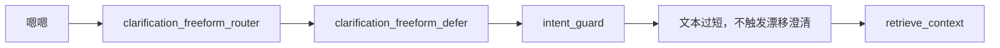

### 15.5 这个分支为什么值得注意

从“代码逻辑”上看，这条链是成立的。

但从“产品效果”上看，这可能并不是理想行为，因为：

- 用户只说了“嗯嗯”
- 系统却可能继续检索，query 非常弱

所以这个场景很适合后续优化。

---

## 16. 用一个状态图总结澄清状态机

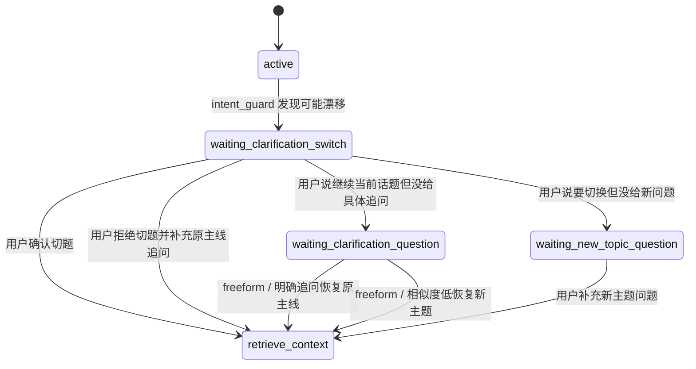

---

## 17. review 流程，也用实例跑一遍

上面已经把澄清和意图漂移跑开了。下面单独演示 review。

---

## 18. 场景 K：命中 review，中断后审批通过

### 18.1 review 版助理配置

这次我们开启 review：

```json
{
  "assistant_id": "asst_hr_02",
  "assistant_name": "高风险政策助手",
  "system_prompt": "高风险政策问题需谨慎回答。",
  "default_model": "gpt-4o-mini",
  "default_kb_ids": ["kb_hr_policy"],
  "review_enabled": true,
  "review_rules": [
    {
      "name": "离职补偿审核",
      "keywords": ["离职补偿", "补偿标准"]
    }
  ]
}
```

### 18.2 当前用户输入

```text
离职补偿标准是多少？
```

### 18.3 graph 内的执行

前面会正常经过：

```text
assistant_config
-> kb_scope
-> question_intake
-> memory_manager
-> clarification_passthrough
-> intent_guard
-> retrieve_context
```

假设检索命中：

```json
[
  {
    "knowledge_base_id": "kb_hr_policy",
    "file_name": "离职与劳动关系制度.pdf",
    "content": "涉及离职补偿的答复需由 HRBP 或法务复核后统一口径输出。",
    "score": 0.77
  }
]
```

#### `review_gate`

因为：

- `review_enabled=true`
- `citations` 非空
- `resolved_question` 命中 `review_rules`

所以输出：

```json
{
  "fallback_reason": "review_required",
  "review_reason": "命中离职补偿审核规则"
}
```

#### `route_after_review_gate`

由于：

```text
fallback_reason == review_required
and review_interrupt_enabled == true
```

进入：

```text
review_hold
```

#### `review_hold`

它会执行：

```python
interrupt({
  "type": "review_required",
  "question": "离职补偿标准是多少？",
  "review_reason": "...",
  "selected_kb_ids": ["kb_hr_policy"],
  "retrieval_count": 1
})
```

这一步的结果是：

- workflow 被挂起
- 外层拿到 `__interrupt__`
- 外层把这轮视为 `fallback_reason=review_required`
- SSE 先给用户返回“需要人工复核”的提示
- 同时创建 review task

### 18.4 中断图

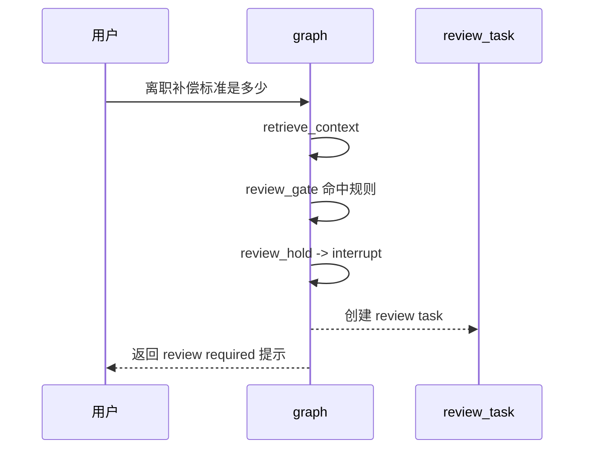

### 18.5 人工审批通过后的恢复

管理员在审核台执行：

```json
{
  "action": "approve",
  "reviewer_note": "可以根据制度摘要回答"
}
```

`ReviewTaskService` 会用：

```python
Command(
    resume={
        "action": "approve",
        "reviewer_note": "可以根据制度摘要回答",
        "manual_answer": ""
    }
)
```

恢复同一个 workflow thread。

恢复后：

#### `review_hold`

返回：

```json
{
  "review_decision": "approved",
  "fallback_reason": null
}
```

#### `route_after_review_hold`

因为当前恢复工作流会用 `include_compose_answer=True`，所以：

```text
approved -> compose_answer
```

#### `compose_answer`

这时才真正调用 `AnswerGenerationService.generate_answer(...)`。

### 18.6 审批通过恢复图

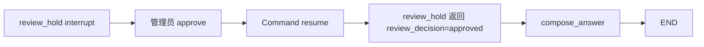

---

## 19. 场景 L：命中 review，中断后审批驳回

和场景 K 前半段一样，差别出现在恢复时。

### 19.1 管理员恢复参数

```json
{
  "action": "reject",
  "reviewer_note": "该问题必须转人工统一答复",
  "manual_answer": "该问题涉及离职补偿统一口径，请联系 HRBP 或法务获取正式答复。"
}
```

### 19.2 恢复后 `review_hold` 的输出

因为：

```text
action == reject
```

所以：

```json
{
  "answer": "该问题涉及离职补偿统一口径，请联系 HRBP 或法务获取正式答复。",
  "citations": [],
  "review_decision": "rejected",
  "fallback_reason": null
}
```

### 19.3 `route_after_review_hold`

此时：

```text
review_decision != approved
```

所以直接：

```text
END
```

不会进入 `compose_answer`。

### 19.4 审批驳回恢复图


### 19.5 这个场景的关键理解

审批通过：

- 后续还能继续自动生成答案

审批驳回：

- `review_hold` 自己就已经产出最终答案
- graph 不再走 `compose_answer`

---

## 20. 场景 M：没有知识库

这个场景不是澄清分支，但它经常和“为什么没进检索”混在一起，顺手演示。

### 20.1 助理配置

```json
{
  "assistant_id": "asst_empty_01",
  "assistant_name": "空助理",
  "default_kb_ids": [],
  "review_enabled": false,
  "review_rules": []
}
```

### 20.2 当前用户输入

```text
年假最多可以休几天？
```

### 20.3 graph 内关键变化

#### `kb_scope`

由于：

- 用户没有显式传 `requested_knowledge_base_ids`
- 助理也没有 `default_kb_ids`

所以输出：

```json
{
  "selected_knowledge_base_id": "",
  "selected_kb_ids": [],
  "citations": [],
  "retrieval_count": 0,
  "fallback_reason": "no_knowledge_base_selected"
}
```

图仍会继续执行到：

```text
question_intake
-> memory_manager
-> clarification_passthrough
-> intent_guard
```

但在 `route_after_intent_guard` 时：

- 没有知识库
- `include_compose_answer=False`

所以直接：

```text
END
```

外层路由再根据 `fallback_reason=no_knowledge_base_selected` 生成兜底回答。

---

## 21. 场景 N：检索无命中

### 21.1 会话状态

```json
{
  "session_status": "active",
  "session_runtime_context": {},
  "message_history": []
}
```

### 21.2 当前用户输入

```text
海外派驻签证补贴标准是什么？
```

### 21.3 graph 执行

前面会正常到 `retrieve_context`。

假设 `retrieve_context` 返回：

```json
[]
```

于是：

```json
{
  "citations": [],
  "retrieval_count": 0
}
```

之后：

- 如果 `review_enabled=false`，`review_gate` 不改 state，工作流结束
- 如果 `review_enabled=true`，也会写 trace 说明“无检索命中，跳过人工复核”

外层 `_stream_or_fallback_answer()` 看到：

```text
citations 为空
```

会返回：

- `build_no_retrieval_hits_answer(...)`

提示用户换个问法，或上传更相关的文档。

---

## 22. 把最绕的澄清与意图漂移压缩成一张时序图

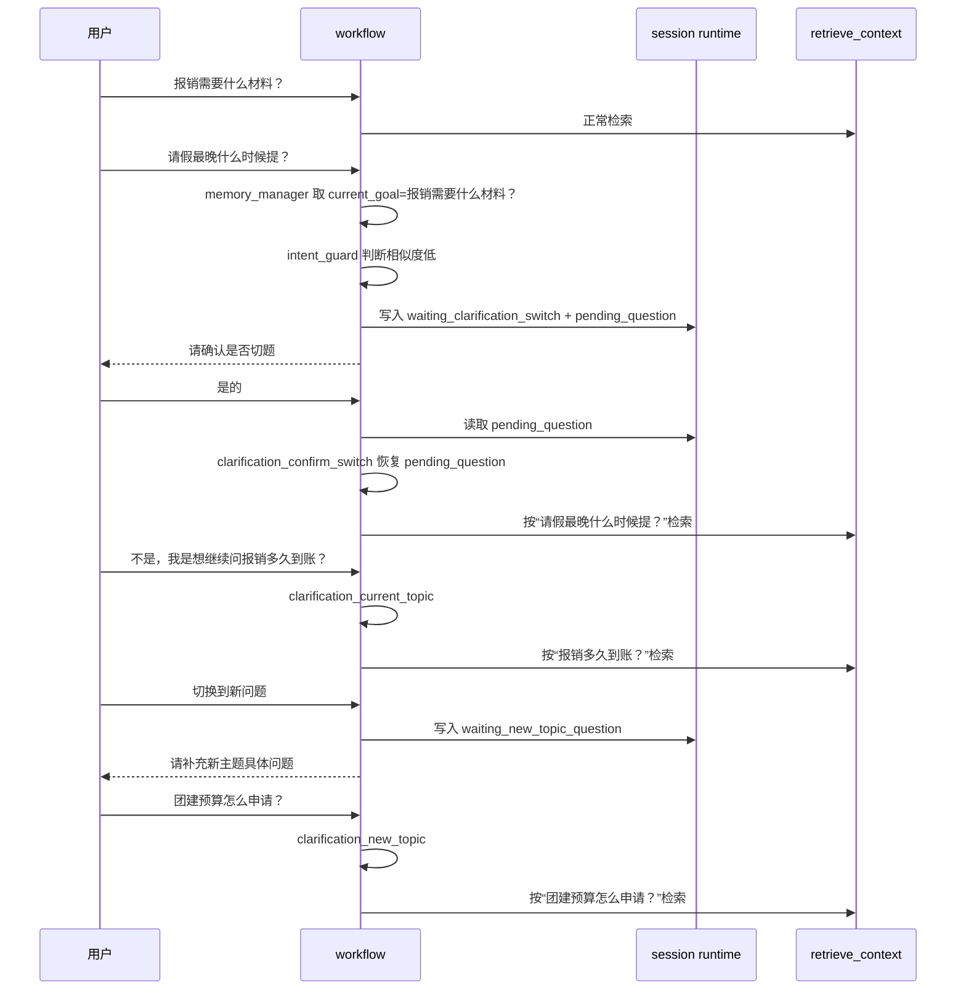

---

## 23. 这份实例文档里最该记住的 12 个点

1. `question_intake` 只做控制语义剥离，不做相似度判断。
2. `memory_manager` 决定 `current_goal`、`resolved_question`、`effective_question`。
3. `current_goal` 是“当前会话主线”，不一定等于当前输入。
4. `effective_question` 是“给检索用的 query”，可能被改写。
5. `clarification_router` 只在 `session_status=awaiting_clarification` 时真正起作用。
6. `clarification_confirm_switch` 用的是上一轮保存的 `pending_question`。
7. `clarification_current_topic` 负责“拒绝切题，继续原主线”。
8. `clarification_new_topic` 负责“确认换题”以及“等待用户补充新题”。
9. `clarification_freeform_router` 是“没有明确控制语义时”的兜底分类器。
10. `intent_guard` 是普通问答进入检索前的最后一道主线保护。
11. `review_gate` 只判断要不要审核，真正的中断发生在 `review_hold`。
12. 当前 SSE 接口里，graph 默认不负责最终答案生成，graph 外层才负责流式 chunk 输出。

## 24. 反过来看，哪些地方最容易让人绕

### 24.1 同一轮里有三个“问题”

| 名称 | 含义 |
| --- | --- |
| `raw_question` | 用户原话 |
| `resolved_question` | 系统认定这轮真正要处理的问题 |
| `effective_question` | 系统最终拿去检索的 query |

### 24.2 当前输入可能不是业务问题，而是控制信号

比如：

- `是的`
- `继续当前话题`
- `切换到新问题`

这类输入本身不一定能检索，但它们会改变 workflow 的路线。

### 24.3 多轮恢复依赖 session runtime，而不是只看当前输入

如果没有这些 runtime 字段：

- `runtime_current_goal`
- `runtime_pending_question`
- `runtime_clarification_stage`

很多“第二轮恢复”其实做不起来。

### 24.4 freeform 分支里存在“实现上可跑，但产品上未必理想”的路径

例如：

- 用户只说“嗯嗯”
- `clarification_freeform_defer` 会回退给 `intent_guard`
- 由于文本太短，`intent_guard` 可能选择继续
- 最终居然还能进入检索

这个分支从代码角度是自洽的，但从产品体验角度值得后续优化。

